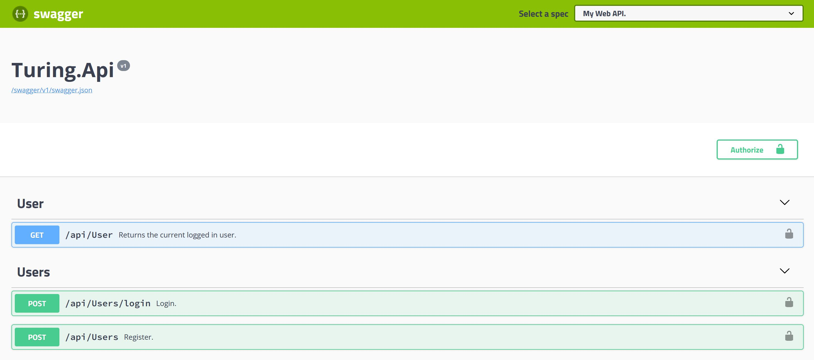

# Turing Practical Test

This application was created for Turing candidates to test their coding skills. This codebase demonstrates a fully fledged backend application built with **ASP.NET Core** . It includes CRUD operations, authentication, routing, pagination, and more.

# Exercises
1. Follow other users
2. CRUD Articles
3. CR*D Comments on articles (no updating required)
4. GET and display paginated lists of articles
5. Favorite articles


# Existing Features

The following features already provided in this application:
- Authenticate users via JWT
- Log-in
- Registration 
- Get logged-in user

# Existing DB Models
This application includes migrations to create DB models for you. Such as:
- User
- FollowedUser
- Article
- ArticleFavorite
- ArticleTag
- Comment
- Tag


# Architecture

This application has been made using the [Dev Adventures .NET Core template](https://marketplace.visualstudio.com/items?itemName=dnikolovv.dev-adventures-project-setup), therefore it follows the architecture of and has all of the features that the template provides.

- [x] Swagger UI + Fully Documented Controllers



- [x] Neat folder structure
```
├───src
│   ├───configuration
│   └───server
│       ├───Turing.Api
│       ├───Turing.Business
│       ├───Turing.Core
│       ├───Turing.Data
│       └───Turing.Data.EntityFramework
└───tests
    └───Turing.Business.Tests
```
- [x] Thin Controllers
- [x] AutoMapper
- [x] EntityFramework Core with Postgres and ASP.NET Identity
- [x] JWT authentication/authorization
- [x] File logging with Serilog
- [x] Stylecop

### Test Suite
- [x] xUnit
- [x] Autofixture
- [x] Moq
- [x] Shouldly
- [x] Arrange Act Assert Pattern

```csharp
[Theory]
[AutoData]
public async Task Login_ShouldReturnException_WhenCredentialsAreInvalid(CredentialsModel model, User expectedUser)
{
    // Arrange
    AddUserWithEmail(model.Email, expectedUser);

    MockCheckPassword(model.Password, false);

    // Act
    var result = await _usersService.LoginAsync(model);

    // Assert
    result.HasValue.ShouldBeFalse();
    result.MatchNone(error => error.Messages?.Count.ShouldBeGreaterThan(0));
}
```

# Getting started

1. Set the connection string in `src/server/Turing.Api/appsettings.json` to a running Postgres instance. Set the database name to an unexisting one.
2. Execute `dotnet restore`
3. Execute `dotnet build`
4. Execute `dotnet ef database update`
5. Execute `dotnet run`
